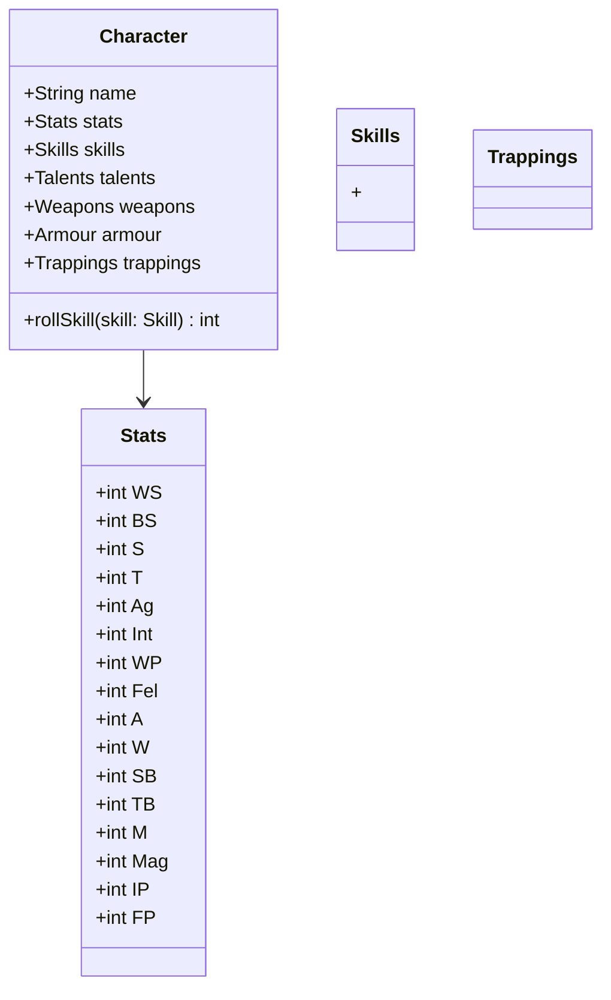

```mermaid
classDiagram
class Character {
+String name
+Stats stats
+Skills skills
+Talents talents
+Weapons weapons
+Armour armour
+Trappings trappings
+rollSkill(skill: Skill) int
}
class Stats {
+int WS
+int BS
+int S
+int T
+int Ag
+int Int
+int WP
+int Fel
+int A
+int W
+int SB
+int TB
+int M
+int Mag
+int IP
+int FP
}
class Skills {
+
}
class Trappings {

}
Character --> Stats
```
