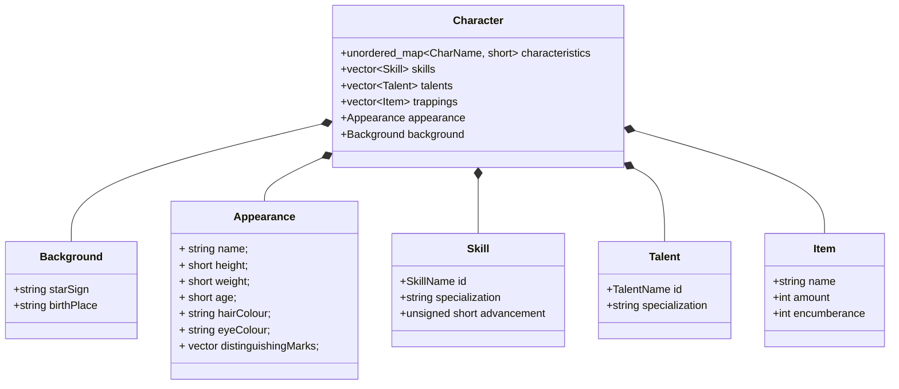

```mermaid
classDiagram
class Character {
+unordered_map~CharName, short~ characteristics
+vector~Skill~ skills
+vector~Talent~ talents
+vector~Item~ trappings
+Appearance appearance
+Background background
}
class Background {
+string starSign
+string birthPlace
}
class Appearance {
+ string name;
+ short height;
+ short weight;
+ short age;
+ string hairColour;
+ string eyeColour;
+ vector distinguishingMarks;
}
class Skill {
+SkillName id
+string specialization
+unsigned short advancement
}
class Talent {
+TalentName id
+string specialization
}
class Item {
+string name
+int amount
+int encumberance
}

Character *-- Background
Character *-- Appearance
Character *-- Skill
Character *-- Talent
Character *-- Item
```
